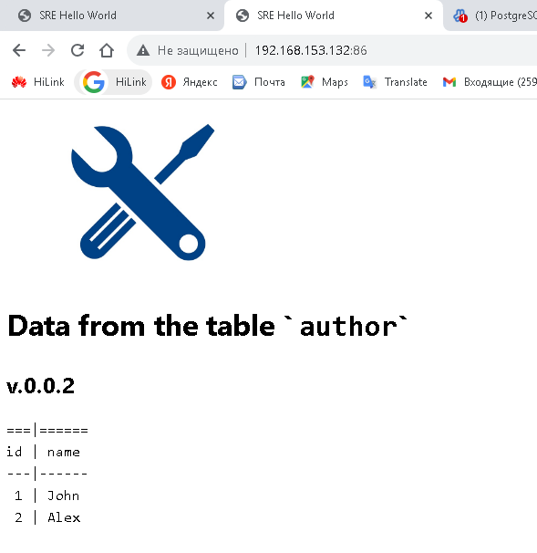

# Запуск проекта sre-hello-world

Тестовое задание для SRE инженера.

## Подготовка к развертыванию

### Скачиваем проект и переходим в директорию

```shell
git clone https://github.com/AleksTurbo/sre-hello-world
cd sre-hello-world
```

### Процесс установки разбит на отдельные роли:

- Установка и подготовка сервера баз данных postgresql
- Установка и настройка web-сервера nginx с конфигурацией проброса подключений
- Подготовка среды docker
- Разворачивание приложения

### Настраиваем общие конфигурационные файлы:

* [hosts](hosts)

### Настраиваем конфигурационные файлы для postgresql:

* [.env](postgresql/vars/.env)
* [main.yml](postgresql/vars/main.yml)

### Настраиваем конфигурационные файлы для nginx:

* [main.yml](nginx/vars/main.yml)

### Настраиваем конфигурационные файлы для приложения:

* [.env](app/files/.env)
* [main.yml](app/vars/main.yml)

## Развертывание

Инсталяция сервера базы данных и тестового содержимого:

```shell
root@linuxsrv:~/sre-hello-world# ansible-playbook install.yml -i hosts

```

- проверка работоспособности:

```shell
root@linuxsrv:/# docker ps
CONTAINER ID   IMAGE                   COMMAND           CREATED   STATUS            PORTS                            NAMES
b382ade821d1   nginx:alpine  "/docker-entrypoint.…"   12 hours ago   Up 12 hours   0.0.0.0:86->80/tcp, :::86->80/tcp  files_nginx_1
95283721d43b   files_php     "docker-php-entrypoi…"   12 hours ago   Up 12 hours   9000/tcp                           files_php_1

```


### Для обновления версии приложения - выполняем сценарий обновления:

#### Настраиваем конфигурационные файлы для источника обновления:

* [main.yml](app-upd/vars/main.yml)

```shell
root@linuxsrv:~/sre-hello-world# ansible-playbook app-apdate.yml -i hosts
```


