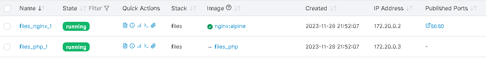

# Запуск проекта sre-hello-world

Тестовое задание для SRE инженера.

## Подготовка к развертыванию

### Скачиваем проект и переходим в директорию

```shell
git clone https://github.com/AleksTurbo/sre-hello-world
cd sre-hello-world
```

### Настраиваем конфигурационные файлы:

* [.env](.env)
* [hosts](hosts)
* [default.yml](vars/default.yml)

## Развертывание

1 - Инсталяция сервера базы данных и тестового содержимого:

```shell
root@linuxsrv:~/sre-hello-world# ansible-playbook 1-pginstall.yaml -i hosts

PLAY [postgresql demdeploy] ****************************************************************************************************************************************************

TASK [Gathering Facts] *********************************************************************************************************************************************************
ok: [localhost]

TASK [Install packages] ********************************************************************************************************************************************************
ok: [localhost]

TASK [Check if PostgreSQL is initialized] **************************************************************************************************************************************
ok: [localhost]

TASK [Empty data dir] **********************************************************************************************************************************************************
skipping: [localhost]

TASK [Initialize PostgreSQL] ***************************************************************************************************************************************************
skipping: [localhost]

TASK [Start and enable service] ************************************************************************************************************************************************
ok: [localhost]

TASK [Create app database] *****************************************************************************************************************************************************
ok: [localhost]

PLAY RECAP *********************************************************************************************************************************************************************
localhost                  : ok=5    changed=0    unreachable=0    failed=0    skipped=2    rescued=0    ignored=0

```

2 - Инсталяция прокси-web-сервера nginx

```shell
root@linuxsrv:~/sre-hello-world# ansible-playbook 2-nginx-install.yaml -i hosts

PLAY [all] *********************************************************************************************************************************************************************

TASK [Gathering Facts] *********************************************************************************************************************************************************
ok: [localhost]

TASK [Install Prerequisites] ***************************************************************************************************************************************************
ok: [localhost] => (item=aptitude)

TASK [Install Packages] ********************************************************************************************************************************************************
ok: [localhost] => (item=nginx)
ok: [localhost] => (item=php-fpm)

TASK [Sets Nginx conf file] ****************************************************************************************************************************************************
changed: [localhost]

TASK [Sets Nginx index file] ***************************************************************************************************************************************************
ok: [localhost]

TASK [Enables new site] ********************************************************************************************************************************************************
ok: [localhost]

TASK [Removes "default" site] **************************************************************************************************************************************************
ok: [localhost]

TASK [UFW - Allow HTTP on port 86] *********************************************************************************************************************************************
ok: [localhost]

PLAY RECAP *********************************************************************************************************************************************************************
localhost                  : ok=8    changed=1    unreachable=0    failed=0    skipped=0    rescued=0    ignored=0

```

- проверка этапа:

```shell
root@linuxsrv:~/sre-hello-world# ansible-playbook check_nginx_status.yaml -i hosts

PLAY [all] *********************************************************************************************************************************************************************

TASK [Gathering Facts] *********************************************************************************************************************************************************
ok: [localhost]

TASK [Make sure nginx.service unit is running] *********************************************************************************************************************************
ok: [localhost]

PLAY RECAP *********************************************************************************************************************************************************************
localhost                  : ok=2    changed=0    unreachable=0    failed=0    skipped=0    rescued=0    ignored=0

```


3 - Инсталяция docker окружения и среды

```shell
root@linuxsrv:~/sre-hello-world# ansible-playbook 3-appinstall.yaml -i hosts

PLAY [app-php docker install] **************************************************************************************************************************************************

TASK [Gathering Facts] *********************************************************************************************************************************************************
ok: [localhost]

TASK [Install packages pip] ****************************************************************************************************************************************************
ok: [localhost]

TASK [Install python and pip] **************************************************************************************************************************************************
ok: [localhost]

TASK [Install docker sdk] ******************************************************************************************************************************************************
ok: [localhost]

TASK [Start docker service] ****************************************************************************************************************************************************
ok: [localhost]

PLAY RECAP *********************************************************************************************************************************************************************
localhost                  : ok=5    changed=0    unreachable=0    failed=0    skipped=0    rescued=0    ignored=0

```

- проверка этапа:

```shell

root@linuxsrv:~/sre-hello-world# docker -v
Docker version 24.0.7, build afdd53b

root@linuxsrv:~/sre-hello-world# systemctl status docker
● docker.service - Docker Application Container Engine
     Loaded: loaded (/lib/systemd/system/docker.service; enabled; vendor preset: enabled)
     Active: active (running) since Wed 2023-11-15 11:39:13 UTC; 5h 14min ago
TriggeredBy: ● docker.socket
       Docs: https://docs.docker.com
   Main PID: 987 (dockerd)
      Tasks: 10
     Memory: 96.3M
        CPU: 4.665s
     CGroup: /system.slice/docker.service
             └─987 /usr/bin/dockerd -H fd:// --containerd=/run/containerd/containerd.sock

Nov 15 11:39:11 linuxsrv dockerd[987]: time="2023-11-15T11:39:11.853305093Z" level=info msg="Starting up"
Nov 15 11:39:11 linuxsrv dockerd[987]: time="2023-11-15T11:39:11.857301163Z" level=info msg="detected 127.0.0.53 nameserver, assuming systemd-resolved, so using resolv.conf: />
Nov 15 11:39:12 linuxsrv dockerd[987]: time="2023-11-15T11:39:12.185398252Z" level=info msg="[graphdriver] using prior storage driver: overlay2"
Nov 15 11:39:12 linuxsrv dockerd[987]: time="2023-11-15T11:39:12.200903455Z" level=info msg="Loading containers: start."
Nov 15 11:39:12 linuxsrv dockerd[987]: time="2023-11-15T11:39:12.863274433Z" level=info msg="Default bridge (docker0) is assigned with an IP address 172.17.0.0/16. Daemon opti>
Nov 15 11:39:12 linuxsrv dockerd[987]: time="2023-11-15T11:39:12.977759493Z" level=info msg="Loading containers: done."
Nov 15 11:39:13 linuxsrv dockerd[987]: time="2023-11-15T11:39:13.097680571Z" level=info msg="Docker daemon" commit=311b9ff graphdriver=overlay2 version=24.0.7
Nov 15 11:39:13 linuxsrv dockerd[987]: time="2023-11-15T11:39:13.100975618Z" level=info msg="Daemon has completed initialization"
Nov 15 11:39:13 linuxsrv systemd[1]: Started Docker Application Container Engine.
Nov 15 11:39:13 linuxsrv dockerd[987]: time="2023-11-15T11:39:13.190192783Z" level=info msg="API listen on /run/docker.sock"

```

4 - Разворачивание приложения в docker

```shell
root@linuxsrv:~/sre-hello-world# ansible-playbook 4-docker-image-playbook.yaml -i hosts

PLAY [all] *********************************************************************************************************************************************************************

TASK [Gathering Facts] *********************************************************************************************************************************************************
ok: [localhost]

TASK [deploy Docker Compose stack] *********************************************************************************************************************************************
changed: [localhost]

PLAY RECAP *********************************************************************************************************************************************************************
localhost                  : ok=2    changed=1    unreachable=0    failed=0    skipped=0    rescued=0    ignored=0

```

- проверка работоспособности:

```shell
root@linuxsrv:~/sre-hello-world# docker ps
CONTAINER ID   IMAGE                    COMMAND                      CREATED       STATUS          PORTS                                     NAMES
41170ab73def   nginx:alpine          "/docker-entrypoint.…"   56 minutes ago   Up 56 minutes   0.0.0.0:86->80/tcp, :::86->80/tcp    sre-hello-world_nginx_1
8f2e69777c3e   sre-hello-world_php   "docker-php-entrypoi…"   56 minutes ago   Up 56 minutes   9000/tcp                             sre-hello-world_php_1

```




### Для обновления версии приложения - обновляем содержимое репозиторияи проводим этап №4


